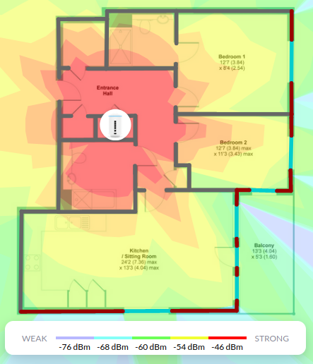

# Martin's Home Automation Project


This repository is my private smart home configuration. It contains the GitOps
configuration for my home [k3s](https://k3s.io/) cluster running [Flux
CD](https://fluxcd.io/), including [Home
Assistant](https://www.home-assistant.io/) for centralised control and
automation of my smart devices.

The main components powering my house are:

- A Raspberry Pi 4 2Gb with a USB-C Ethernet adapter running
  [OpenWRT](https://openwrt.org/) as my router and VPN client
- [UniFi Dream
  Machine](https://store.ui.com/collections/unifi-network-routing-switching/products/unifi-dream-machine)
  as a switch and wireless access point
- [UniFi Switch 8 150W](https://www.ui.com/unifi-switching/unifi-switch-8-150w/)
  as a secondary switch providing PoE and additional ports
- [Synology DS216j
  NAS](https://global.download.synology.com/download/Document/Hardware/DataSheet/DiskStation/16-year/DS216j/enu/Synology_DS216j_Data_Sheet_enu.pdf)
  for laptop backups and also exposing NFS volumes to my Kubernetes cluster via
  the
  [nfs-subdir-external-provisioner](https://github.com/kubernetes-sigs/nfs-subdir-external-provisioner).
  It regularly backs up to [Amazon S3 Glacier](https://aws.amazon.com/glacier/)
- A Raspberry Pi 3b running [Pi-Hole](https://pi-hole.net/) as a network ad
  blocker
- 3 Raspberry Pi 4 8Gb forming the Kubernetes cluster

My Home Assistant instance is the brains for all smart home automations. This
project is *fantastic*. Mine is connected to:

- [Philips Hue](https://www.philips-hue.com/en-gb) smart lights, switches, and
  motion sensors
- [SONOFF ZBBridge](https://sonoff.tech/product/smart-home-security/zbbridge/)
  flashed with [Tasmota firmware](https://tasmota.github.io/docs/), acting as
  a bridge for Zigbee-based devices and connected via WiFi to Home Assistant
- [SONOFF SNZB-02](https://sonoff.tech/product/smart-home-security/snzb-02/)
  wireless temperature and humidity sensors
- [SONOFF SNZB-04](https://sonoff.tech/product/smart-home-security/snzb-04/)
  wireless door/window sensors
- [Eclipse Mosquitto](https://mosquitto.org/) MQTT broker, connected to Home
  Assistant, that devices speaking MQTT can send messages to
- Xiaomi Mi Flora plant sensors, providing humidity, temperature, light, and
  conductivity readings over Bluetooth using the Pi's BLE stack
- [Mi Flora MQTT Daemon](https://github.com/ThomDietrich/miflora-mqtt-daemon), a
  daemon that polls all configured Mi Flora sensors and pushes the results to
  Mosquitto
- [TP-Link Kasa
  KP115](https://www.tp-link.com/uk/home-networking/smart-plug/kp115/) WiFi
  smart plugs to provide both control and energy monitoring of our appliances
  such as humidifiers
- Security cameras

The main component that is not yet automated is my underfloor heating - a smart
thermostat with zone support is on the list of things to investigate later.

## Network Layout

I do not use IPv6 on my home network and all devices currently are on the same
VLAN.

| Range            | Max devices | Description                                 |
|------------------|-------------|---------------------------------------------|
| 192.168.1.0/28   |          14 | Networking hardware (Router, switches, APs) |
| 192.168.1.16/28  |          14 | Infrastructure (DNS, storage, printer)      |
| 192.168.1.32/28  |          14 | Kubernetes cluster                          |
| 192.168.1.128/25 |         126 | DHCP allocation range                       |
| 192.168.2.0/24   |         254 | Office network                              |
| 192.168.3.0/24   |         254 | IoT network                                 |
| 192.168.4.0/24   |         254 | Guest network, all devices isolated         |

The UDM is the DHCP server and all DHCP advertisements from other clients are
blocked.

My house isn't huge so a single Dream Machine is enough to give good 5GHz
coverage for the whole house without any extra access points.



## Pi-hole configuration

The Pi-hole uses multiple restriction lists and serves a few LAN DNS entries. It
resolves non-blacklisted addresses using a local
[Unbound](https://www.nlnetlabs.nl/projects/unbound/about/) installation. It is
currently running on an 8gb Pi 4B which is much larger than it needs, so I
intend to move this into the K3s cluster. I also intend to store its
configuration in this repo as I currently have no backup of it.

This setup lets me have a local DNS cache for fast responses, improves DNS
security, and doesn't let Google/OpenDNS/Cloudflare/Quad9 see our DNS queries.

TODO: Discuss DNSSEC and the benefits of unbound.

TODO: Look into implementing a Pi-hole module for
[external-dns](https://github.com/kubernetes-sigs/external-dns/), letting me add
custom Pi-hole DNS entries via Kubernetes =Service= objects.

## Notes

TODO: Add notes in case I need to rebuild this from scratch and to help other people:

- Setting up OpenWRT on the Pi
- Configuring Pi-hole and Unbound. I used
  [these docs](https://openwrt.org/toh/raspberry_pi_foundation/raspberry_pi)
- Installing K3s via [k3sup](https://github.com/alexellis/k3sup)
- My Kubernetes cluster
- Switch setup and IP allocation
- Power supplies
- Cooling
- Ansible configuration for managing the Raspberry Pis

### Adding a new Pi to my Kubernetes cluster

Setting up a new Pi is pretty simple:

- Use the [Raspberry Pi
  Imager](https://www.raspberrypi.org/blog/raspberry-pi-imager-imaging-utility/)
  tool to flash the MicroSD card, connect it to the switch and power up
- SSH in, change the password
- Set the hostname (e.g. `k8s-worker-3` in `/etc/hostname`)
- Update everything (`sudo apt-get update && sudo apt-get upgrade`)
- Set a static IP in the Kubernetes subnet in the Unifi controller
- Print out a sticky label and label the network cable with the hostname (lesson
  learned the hard way)
- Add `cgroup_memory=1 cgroup_enable=memory` to the end of
  `/boot/firmware/cmdline.txt`
- Reboot the host (`sudo reboot`)
- Copy my public key - the new hostname should resolve now (`ssh-copy-id
  ubuntu@k8s-worker-3`)
- Add the host to my Ansible inventory in `ansible/home.yml`
- Run Ansible (`ansible-playbook -i home.yml site.yml`)
- Run `k3sup`:

```sh
k3sup join --server-host k8s-master --host k8s-worker-3 --user ubuntu
```

- Watch as the node is joined and the Rancher `system-upgrade-controller`
  cordons the node and upgrades it to the correct version and uncordons it

### Upgrades

TODO: Document rancher automated upgrades

```sh
kubectl apply -f https://github.com/rancher/system-upgrade-controller/releases/download/v0.6.2/system-upgrade-controller.yaml
```
